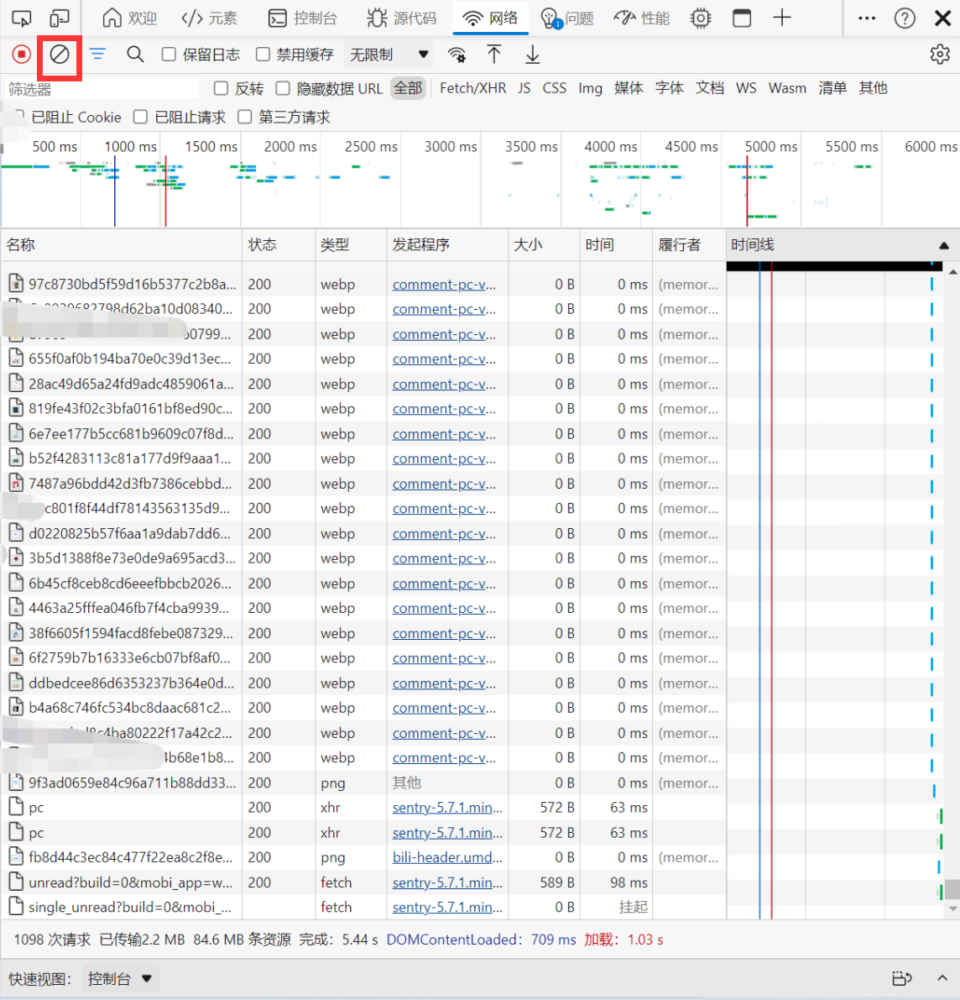
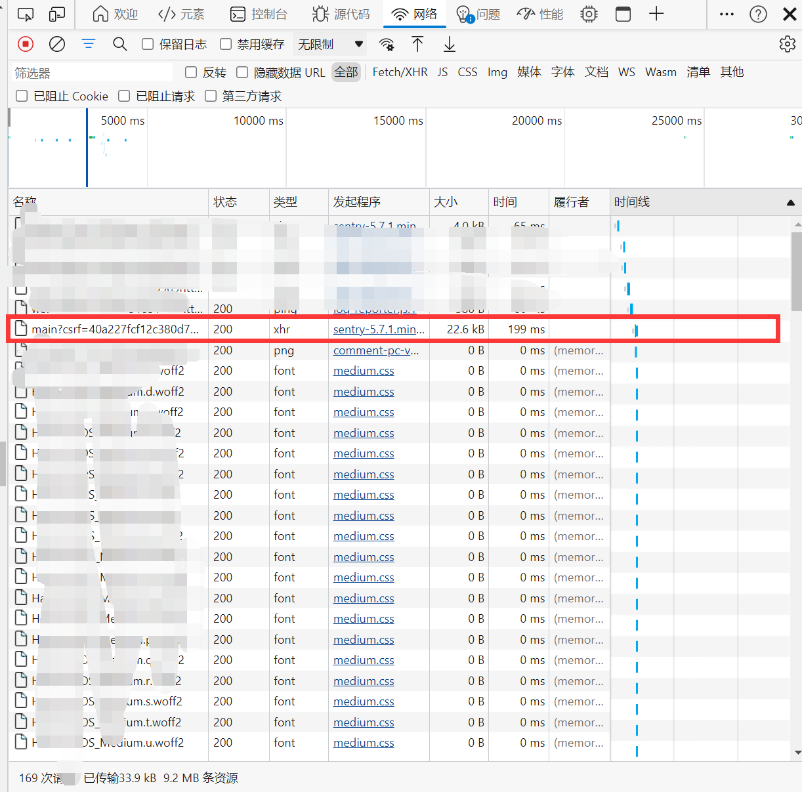
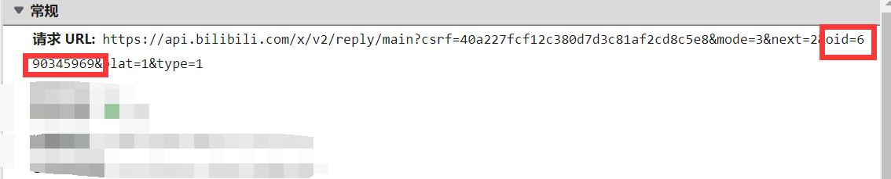
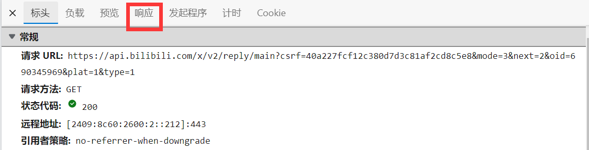
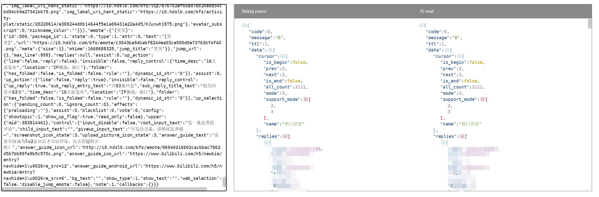
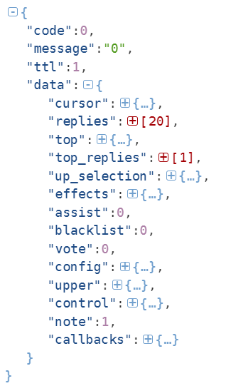

# &#x1F308;&#x1F308;&#x1F308;bilibili评论爬取&#x1F308;&#x1F308;&#x1F308;（代码文件只有crawl.py）

# 如果遇到代码已经无法运行了请及时提醒我，可以提Issues，我会尽快更新！！！！！！

本人比较喜欢做情感分析的NLP项目，因此突发奇想想到去B站收集信息。

1、[声明](#para1) 2、[url参数解析](#para2) 3、[如何爬取想要的视频评论](#para3) 4、[核心代码](#para4) 5、[BUG提示](#para5) 6、[资源包获取方式](#para6)

⭐**重点**：**但是本项目只是学习使用，如果用作任何其他用途，本人概不负责！！！**⚠⚠⚠

# ⭐<a id="para1"/>声明&#x1F379;&#x1F379;&#x1F379;

###该项目只适用学习其他任何用途均不可使用！！！

###该项目只适用学习其他任何用途均不可使用！！！

###该项目只适用学习其他任何用途均不可使用！！！

# <a id="para2"/>url参数解析&#x1F37A;&#x1F37A;&#x1F37A;

expample: https://api.bilibili.com/x/v2/reply/main?csrf=40a227fcf12c380d7d3c81af2cd8c5e8&mode=3&next={}&oid=860478472&plat=1&type=1

csrf：固定是40a227fcf12c380d7d3c81af2cd8c5e8（不太清楚含义）

mode：应该是一种模式 （也不太清楚含义）

⭐**next**：按照实验应该是一个起始页的指示，可以从0开始

⭐**oid**：代表每个视频的唯一标识

plat：不清楚含义

type：不清楚含义

- ⭐**重点**：**修改一词next的值可以爬取到20条评论**，这个我没有分析出来是哪个参数控制的，但是大家也不要去修改，毕竟是学习不要去恶意修改其他的参数。
- ⭐**重点**：**核心参数只需要修改；1、oid：视频唯一标识码；2、next：评论起始页（从0开始）**

# <a id="para3"/>如何爬取想要的视频评论&#x1F345;&#x1F345;&#x1F345;

步骤：

- 1、找到自己想要爬取视频的oid

- 2、设置url比如：

  ```python
  # next={}预留的地方就是用来控制起始页数的位置，经过验证是可以从0开始的，到时候for循环的时候用.fotmat()方法补全即可
  # oid={}只需要找到自己想要爬取的视频的oid码就行了
  url = "https://api.bilibili.com/x/v2/reply/main?csrf=40a227fcf12c380d7d3c81af2cd8c5e8&mode=3&next={}&oid=去找到自己想要爬取的视频的oid码然后把这儿替换掉即可&plat=1&type=1"
  ```

- 3、如何爬取到所有的comment（⭐重点）

  因为我首先没有先去找所有的评论到底有多少，因此需要自行进行逻辑判断，我的方法是：

  ```python
  # 就是只爬取能搜索到20条完整评论的评论，在最后的时候如果评论数已经不足20条，则放弃，这样也不会损失多少数据对于评论比较多的视频，如果评论数太少的视频大家可以自行修改代码将这部分删除即可。
  comment = []
  if len(comment) % 20 != 0:
      print("一共爬取到{}条评论".format(len(comment)))
      break
  else:
      print("搜集到%d条评论" % (len(comment)))
  ```

# <a id="para4"/>核心代码&#x1F30F;&#x1F30F;&#x1F30F;

```python
import requests

# 范例url：https://api.bilibili.com/x/v2/reply/main?csrf=40a227fcf12c380d7d3c81af2cd8c5e8&mode=3&next=3&oid=861032963&plat=1&type=1
# 如果有不懂的参照这个url对比下就知道了

url = "https://api.bilibili.com/x/v2/reply/main?csrf=40a227fcf12c380d7d3c81af2cd8c5e8&mode=3&next={}（这儿提示，从0开始即可）&oid=（替换成自己想要爬取的视频的oid码即可）&plat=1&type=1"

header = {
    "user-agent": "替换成自己的user-agent即可",
    "cookie": "替换成自己的cookie即可"
}

comment = []
for i in range(100):
    responses = requests.get(url=url.format(i), headers=header).json()
    for content in responses["data"]["replies"]:
        comment.append(content["content"]["message"])
    if len(comment) % 20 != 0:
        print("一共爬取到{}条评论".format(len(comment)))
        break
    else:
        print("搜集到%d条评论" % (len(comment)))

with open("bilibili_comment.txt", "w", encoding="utf-8") as fp:
    for c in comment:
        fp.write(c + "\n")
```

# <a id="para5">BUG提示（⚠⚠）&#x1F30F;&#x1F30F;&#x1F30F;

有时候爬取了一会就会碰到不足20条的数据，这时候根据我的代码逻辑，就会直接退出爬虫

```python
if len(comment) % 20 != 0:
	print("一共爬取到{}条评论".format(len(comment)))
	break
else:
	print("搜集到%d条评论" % (len(comment)))
```

因此如果碰到就爬取了一会儿爬虫就停了的情况，那么删除上面这部分代码即可，不影响程序运行，但是嘿嘿，这时候你就要手动去控制爬虫了，因为如果你设置的起始页太大，超过了他全部的评论那么后面会有非常多重复的评论。我给出的方法就是：

- 看此处有多少评论然后除以20，自己判断有多少就设置多少

  

# <a id="para6">资源包获取方式（重点⭐），如果只是使用代码则不需要看此处！⭐⭐⭐⭐⭐⭐⭐在此重申，本项目只适用学习，任何其他用途本人概不负责&#x1F30F;&#x1F30F;&#x1F30F;

1、评论包的位置步骤：

- 1、首先找到任一视频打开F12

  

  

- 2、因为比较杂乱，点击该位置将这些资源包删除

  

  

- 3、拖动滚轮向下滑动直到出现一个这样的资源包即可

  

  

- 4、将其点开，就能找到对应视频的oid码了

  

  

- 5、评论资源所在位置，点击方框处

  


- 6、看到其中的内容然后Crtl-A + Crtl-C，全选复制，然后在网上随便搜一个在线JSON解释器粘贴进去即可

  

  

- 7、然后点击那些（➖减号）啥的符号慢慢整理可以看到一个这样的列表

  

- 8、最后所需要的评论就在

  

- 9、对应的python字典获取格式就是：

  ```python
  # 可以发现data下的replies其实通过字典访问的方式就可以得到一个长度为20的列表了（这儿看第7步的图片就可以看出来）
  # 每个列表下又是一个字典，这时候通过访问key："content",然后又是一个字典在访问key："message"就可以拿到数据了
  # 举个例子：
  responses = requests.get(url=url, headers=header).json()
  # 拿到返回了的json数据
  replies = responses["data"]["replies"] # 这样就可以得到一个长度为20的列表了
  # 然后在循环该列表，就可以拿到数据了
  for content in replies:
      print(content["content"]["message"])
  ```

  
